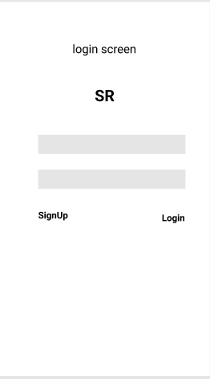

# Short Yummy Recipes

## Table of Contents
1. [Overview](#Overview)
1. [Product Spec](#Product-Spec)
1. [Wireframes](#Wireframes)
2. [Schema](#Schema)

## Overview
### Description
Deciding on what dish to prepare with the available ingredients? 
This app tracks ingredients a user inputs into the app and tries to match it with the one's available in the database.
If a large portion of the user's input (Approx. 80-90%) matches with the ingredients for the dish in the database, a short recipe will be presented to the user to prepare a dish.

### App Evaluation
[Evaluation of your app across the following attributes]
- **Category:** Food & Drinks / Lifestyle
- **Mobile:** This app would be primarily developed for mobile. Functionality wouldn’t be limited to mobile devices, however mobile version could potentially have more features.
- **Story:** A simple app where user can search for recipes based on the ingredients they have.
- **Market:** Culinary experts and enthusiasts, bachelors, students
- **Scope:** The scope of this app limited to individual users currently. 

## Product Spec

### 1. User Stories (Required and Optional)

**Required Must-have Stories**

* Users can read any of the new recipes posted by the application developers or any user.
* Create an account for the app to upload their recipes.
* Option to enter their current set of ingredients.
* View a set of recipes that are the closest match to their requirement.

**Optional Nice-to-have Stories**

* Personalised recommendation based on their previous views.
* Voice enabled option to search for recipes.
* Link the app with Amazon to order the remaining ingredients for the user.

### 2. Screen Archetypes

* Login/Signup 
   * A new user can sign up
   * An existing user can login
* Feed
   * User can see all popular recipes 
* Search
   * User can search based on ingredients
   * User can add or remove ingredients
   * User can star recipes
* Add
   * User can add a new recipe
* User Details
   * User can see their details
   * User can logout
   * User can update their details

### 3. Navigation

**Tab Navigation** (Tab to Screen)

* Search
* Add 
* User Details

**Flow Navigation** (Screen to Screen)

* Login/Signup
   * Feed
* Feed
   * Add
   * Search
   * User Details

## Wireframes

### [BONUS] Digital Wireframes & Mockups

### [BONUS] Interactive Prototype

## Schema 

### Models

* User

| Property | Type   | Description                       |
|----------|--------|-----------------------------------|
| emailID  | String | email ID of the user              |
| username | String | unique username for the user      |
| password | String | password to authenticate the user |

* Recipe

| Property | Type   | Description                       |
|----------|--------|-----------------------------------|
| recipeID  | String | unique ID of the recipe (default field)    |    
| recipeTitle  | String | title/name of the recipe   |  
| recipeIngredients | Array | ingredients used in the recipe |
| prepTime | Number | recipe preparation time in hours |
| cookTime | Number | time to cook in hours |
|recipe | String | the recipe given by user |
| image | File | password to authenticate the user |
| createdBy | Pointer to User | recipe creator      |
|numLikes | Number | number of likes on the recipe |

### Networking
- [Add list of network requests by screen ]
- [Create basic snippets for each Parse network request]
- [OPTIONAL: List endpoints if using existing API such as Yelp]
